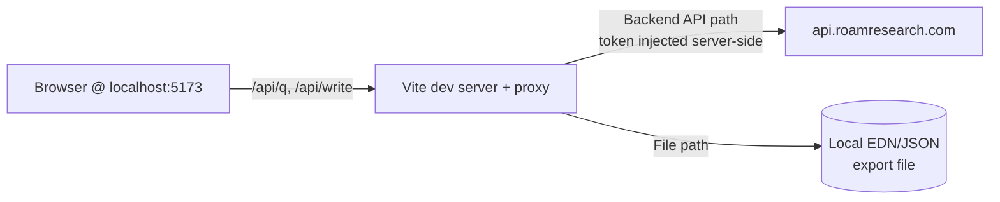

# roam-gantt: v1 plan


## Context


The repo is empty except for `CLAUDE.md`. Goal: a **local-desktop web app** that reads TODO blocks from a Roam graph — scoped by a tag list and/or a tag-namespace prefix — and renders them as a Gantt chart. Bars are click-to-toggle between `{{[[TODO]]}}` and `{{[[DONE]]}}`. Read-only for dates in v1.


Two architectural wrinkles drive the shape of the plan:


1. **There is no "local" Roam API.** From outside Roam, the only programmatic access is the cloud **Backend API** (`https://api.roamresearch.com/api/graph/<graph>/q` + `/write`), which requires a graph token (paid "Believer" feature). The app runs locally, but it reaches a cloud endpoint. Browsers can't hit that endpoint directly (CORS + secret token), so the local app ships its own tiny proxy.

2. **Date encoding in Roam is conventionless.** Nothing in Roam natively marks a TODO as "starts Apr 10, ends Apr 20." We pick a convention and document it. Recommendation below.


A file-based fallback path (pointing the app at a Roam EDN/JSON export) is included so the app is usable without a Believer subscription.


## Architecture





Single process in dev: Vite serves the React app and proxies `/api/*` to Roam (injecting the token from `.env`) or reads a local export. In "export" mode, no network; in "live" mode, the proxy is the only thing that ever sees the token.


## Data flow


```

┌─ Config ─────────┐    ┌─ Fetch ──────────┐    ┌─ Parse ────────────┐    ┌─ Render ──────┐

│ graph name       │ →  │ Datalog query    │ →  │ block → Task       │ →  │ Gantt chart   │

│ tags (list/prefix)│   │ for tagged TODOs │    │ resolve start/end  │    │ (grouped rows)│

│ date strategy    │    │ + their children │    │ resolve status     │    │ toggle TODO   │

│ source (API|file)│    └──────────────────┘    └────────────────────┘    └───────┬───────┘

└──────────────────┘                                                              │

                                                                                  ▼

                                                                     ┌─ /api/write ────┐

                                                                     │ flip TODO⇄DONE  │

                                                                     └─────────────────┘

```


## Scope resolution (tag list + namespace)


Input accepts two fields that union together:

- **Explicit list**: `["project/alpha", "design-review"]`

- **Prefix**: `project/` → expands to every page whose title starts with `project/`


Resolution query: find all page titles matching either predicate, then find every block that references any of those pages AND whose string contains `{{[[TODO]]}}` or `{{[[DONE]]}}`. One Datalog query; one round-trip.


## Date convention (recommended, since undecided)


**Primary**: child attributes on the TODO block.

```

{{[[TODO]]}} Ship beta #project/alpha

  start:: [[April 10th, 2026]]

  end::   [[April 20th, 2026]]

```


**Fallbacks, in order**:

1. `due::` attribute only → milestone (zero-duration diamond on `due`).

2. Exactly one `[[date]]` ref in the block string, no `start::`/`end::`/`due::` → milestone on that date.

3. Exactly two `[[date]]` refs in the block string → treat earliest as start, latest as end.

4. Anything else → task goes into an "Unscheduled" lane (visible but not placed on the timeline).


Why this ordering: `start::/end::` is unambiguous and Roam-idiomatic (matches how Roam attributes work elsewhere). Text-ref fallbacks catch existing TODOs without requiring the user to restructure their graph first. Unscheduled lane surfaces what's missing instead of silently dropping tasks.


## Tech stack


- **Vite + React + TypeScript** — scaffold with `npm create vite@latest roam-gantt -- --template react-ts`.

- **Gantt lib: `gantt-task-react`** — TypeScript-native, MIT, supports day/week/month zoom, click handlers, grouping. No heavy custom SVG work for v1.

- **State: TanStack Query** — fits "fetch, cache, refetch on config change" exactly; avoids a store library.

- **Styling: plain CSS modules** — nothing fancy for v1.


## File layout


```

roam-gantt/

├─ package.json

├─ vite.config.ts              # dev proxy: /api/roam/* → api.roamresearch.com, inject token

├─ .env.example                # ROAM_GRAPH, ROAM_TOKEN, SOURCE_MODE=api|file, EXPORT_PATH

├─ .gitignore                  # .env, node_modules, dist

├─ index.html

├─ src/

│  ├─ main.tsx

│  ├─ App.tsx                  # layout: <ConfigPanel /> + <GanttView />

│  ├─ config/

│  │  ├─ ConfigPanel.tsx       # tag list, prefix, date strategy toggle

│  │  └─ useConfig.ts          # persisted to localStorage

│  ├─ api/

│  │  ├─ client.ts             # fetch wrapper, hits /api/roam/q and /api/roam/write

│  │  ├─ queries.ts            # Datalog strings (findTaggedTodos, resolveTagScope)

│  │  └─ mutations.ts          # toggleStatus(uid, next)

│  ├─ parse/

│  │  ├─ tags.ts               # expand prefix + explicit list into page-title set

│  │  ├─ dates.ts              # "April 17th, 2026" ⇄ Date; ordinal suffix handling

│  │  └─ tasks.ts              # block+children → Task, apply fallback ordering

│  ├─ gantt/

│  │  ├─ GanttView.tsx         # wraps gantt-task-react

│  │  ├─ grouping.ts           # group rows by primary tag

│  │  └─ TaskDetail.tsx        # side panel: block text, roam deep link, toggle button

│  └─ types.ts                 # Task, RoamBlock, TagScope

├─ server/                     # only if Vite's built-in proxy isn't enough

│  └─ proxy.ts                 # express fallback for file-source mode

└─ README.md                   # setup, token, source modes, date convention

```


Start with Vite's built-in proxy (`server.proxy` in `vite.config.ts`) — the `server/` directory is only needed if the file-source path grows complex.


## Implementation order


1. **Scaffold + config panel, no data.** Vite app renders a form with tag inputs and a mocked task list. Gantt chart displays the mocks. Confirms the rendering library fits.

2. **Local EDN/JSON export parser.** Load a sample export from disk, parse tags/TODOs, feed the Gantt. No network, no token — most of the parsing logic lives here and is testable in isolation.

3. **Live Backend API path.** Vite proxy + Datalog queries, token from `.env`. Toggle a `SOURCE_MODE` flag to switch between export and live.

4. **Status toggle write-back.** `/write` call to flip `{{[[TODO]]}}` ⇄ `{{[[DONE]]}}` in the block string; optimistic update + refetch on error.

5. **Polish**: deep-link to Roam block, grouping by tag, "Unscheduled" lane, zoom controls.


Steps 1–2 have zero dependency on having a Roam token, so the project is unblocked immediately.


## Key open questions (worth deciding before step 3)


- **Do you have a Believer/Backend-API token?** If no, step 3 is blocked and the app lives on export files only. Export-only is still useful but needs a manual re-export to refresh.

- **Namespace semantics on nested tags.** Does `project/` match `project/alpha/sub-task`? Recommend: yes (pure prefix match, no depth limit).

- **Grouping axis.** Group Gantt rows by primary tag, by parent block, or flat? Recommend: by primary tag (the first matching tag in `tags`/`prefix` scope), with flat as a toggle.

- **Multiple date candidates in one block.** If a TODO has `start::` *and* two inline `[[date]]` refs, which wins? Recommend: attributes always win; inline refs are fallback-only.

- **Timezones.** Roam daily-note pages are date-only (no time). Treat all tasks as whole-day in the local timezone; don't try to parse times from block text for v1.


## Verification


- **Parsing**: unit tests on `parse/dates.ts` (ordinal suffixes, all 12 months, leap day) and `parse/tasks.ts` (each fallback tier, unscheduled case, DONE vs TODO).

- **Scope resolution**: unit test `parse/tags.ts` against a fixture page-title list — prefix + explicit + dedupe.

- **Live end-to-end (manual)**: point at a real graph, set `prefix: "project/"`, confirm every `{{[[TODO]]}}` under any `project/*` page appears; click a bar, confirm the Roam block flips to `{{[[DONE]]}}` in both the app and in Roam itself; refresh and confirm state persists.

- **Export end-to-end (manual)**: drop a Roam JSON export in `./fixtures/`, point `EXPORT_PATH` at it, confirm the same tasks render with no network calls (verify in DevTools Network tab).

- **Smoke**: `npm run build` succeeds; `npm run dev` starts and serves the app on localhost.

